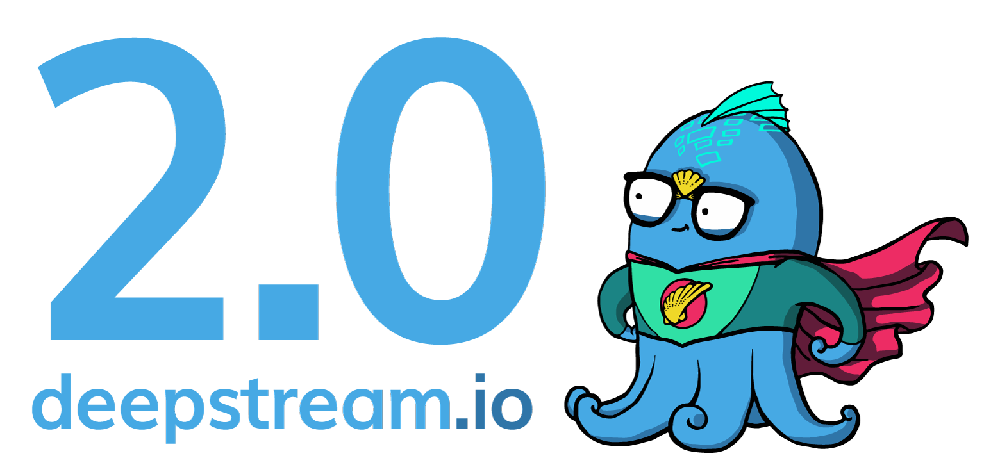

Realtime is growing fast. From collaborative edits in Google Docs, chatting on Slack or auto-synced Trello cards to fully fledged trading platforms, multiplayer games or smart home controls, more and more apps are using bi-directional connections and streaming updates to deliver data as soon as it becomes available.

Even traditionally static sites like social networks or news pages are increasingly abandoning the refresh-button and broadcast updates when they happen.

But with the growing demand for realtime features comes the need for a robust and secure technology to power these at scale.

This is why we’ve built deepstream.io: A lightning fast server that provides data-sync, pub-sub and request-response as well as all the security, failover, loadbalancing and encryption features necessary for scalable production realtime apps. If you’d like to learn more about what deepstream is and how it works, have a look at [“what is deepstream?”](/tutorials/guides/what-is-deepstream/)

## deepstream 2.0
Today we are proud to announce deepstream 2.0 - with a new messaging core, support for presence (who’s online) and substantial performance improvements.

## Benchmarks
We are continuously running and expanding our suite of benchmarks to ensure deepstream’s performance and stability under heavy load and high concurrency. For the 2.0 release we’ve conducted a series of tests comparing the performance of deepstream.io against [socket.io](http://socket.io/) - one of the most widely used connectivity libraries.

This test fully concentrates on publish-subscribe - a pattern both deepstream and socket.io provide. Deepstreams core features of data-sync and request-response will be omitted

## Testing procedure
The tests were conducted using purpose-built benchmark clients written in C++ 11. The clients and all other test components can be found [here](https://github.com/deepstreamIO/deepstream.io-benchmarks) to allow for inspection and replication of tests.

Each test starts by creating a given number of subscribers and publishers, all for the same channel. Once all are established a timer is started and a message for each publisher is sent. Once all subscribers have received the message, the timer stops. This is repeated ten times for each publisher/ subscriber combination and the average latency is logged.

We've repeated all sets of tests against both deepstream and socket.io 4-core Fedora machines.

This resulted in the following latencies:

| subscriber | publisher | latency deepstream | latency socket.io | factor |
|------------|-----------|--------------------|-------------------|--------|
| 10         | 1         | 1.28ms             | 0.26ms            | x0.20  |
| 10         | 5         | 1.33ms             | 1.15ms            | x0.86  |
| 100        | 10        | 1.63ms             | 19.38ms           | x11.8  |
| 100        | 50        | 1.81ms             | 93.72ms           | x52    |
| 1000       | 100       | 10.87ms            | 2118ms            | x195   |
| 1000       | 500       | 22.97ms            | 10496ms           | x457   |
| 10000      | 1000      | 194.83ms           | 262665ms          | x1348  |
| 10000      | 5000      | 711.50ms           | 1318330ms         | x1853  |

## Interpreting these results
Deepstream uses a one millisecond buffer timeout for messages whereas socket.io broadcasts every message immediatly. This means that for small amounts of connected clients socket.io messages will be send out faster whereas deepstream takes about one millisecond longer.
At around 60 connected subscribers, socket.io begins to fall behind and deepstream takes the lead. For 100 subscriber and 50 publishers, deepstream is already about 52 times faster - scaled to 10.000 subscribers and 1.000 publishers the gap widens dramatically with deepstream delivering all messages in less than 200 ms whereas socket.io takes around 4.3 minutes.

## Scaling beyond these results
All benchmarks ran against a single node. It is worth mentioning that both deepstream and socket.io allow for horizontal scalability and multi-node clusters by using a message bus. Socket.io [supports Redis pub/sub for this](http://socket.io/docs/using-multiple-nodes/), deepstream can be used with [Redis](/tutorials/integrations/cache-redis/) as well as [Kafka](/tutorials/integrations/msg-kafka/) or most [AMQP brokers](/tutorials/integrations/msg-amqp/)

## What makes deepstream that much faster?
For performance differences of this magnitude its always important to understand how these were achieved. For deepstream it's mainly two factors that play into this:

### Eventual consistency
Deepstream employs an eventual consistency model with negative acknowledgements. States are tracked using version numbers. If a version is missing or a conflict occurs, a reconciliation sequence is initiated or a merge function invoked. Dropping the need to acknowledge every individual message on an application level reduces roundtrip times and bandwith and improves performance dramatically.

### Architecture
Deepstream’s messaging core is written in C++, its business logic in Node. Both bind into each other using Node’s addon API(https://nodejs.org/api/addons.html) and are compiled into a single Mac/Windows executable or Linux package.
This might sounds like a terrible design choice, but it works impressively well. Our tests have shown that due to the way deepstream is written, its node layer is only slightly slower compared to a pure C++ implementation - but massively benefits from the higher stability, type-safety and richer ecosystem that come with the higher level programming language.

## Where to go from here
If you’d like to find out more about deepstream, have a look at the [What is deepstream?](/tutorials/guides/what-is-deepstream/) section. If you’d like to give it a go, head over to the [getting started tutorial](/tutorials/core/getting-started-quickstart/).