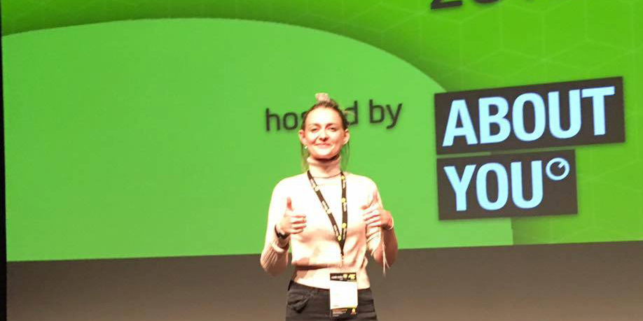

For months now deepstream.io has been navigating the rough waters of open source - and to some extent successfully so. As a long-term PR professional but first time dabbler in open source community management - I'd love to share what I learned along the way.

## Peer to peer communication
The like-minded people that communicate by voluntarily writing and exchanging code, seem driven by pure passion to solve complex problems. The network effect of working cooperatively to promote projects has in many cases resulted in exponential growth.  

Don't underestimate the power of casual discussion mentioning your project. It demonstrates interest, adoption, insight, and presents the opportunity to answer questions / help spread positive awareness and support the general cause for improvement and sustainability of open source technologies.

The channels on GitHub, Slack and Stack Overflow have helped us connect with developers from all over the world. These have allowed us to focus on delivering the best solutions to recurring problems, and creating a product easily accessible and used by many from a range of industries including messaging, finance and IoT. (cheers guys!)

So - how do we continue to build on engaging this community of software-rions, to discover more programmers who support the open source philosophy by helping produce revolutionary software? 

## Be there for your users and contributors 
As the maintainer of an open source project you should think of your contributors as potential new friends. You both have a common interest. People generally like discussing their interests. So, go ahead. Ask their opinion. And get arguing if necessary. (in my experience it always seems necessary.) 
Also, it’s not a bad idea to personally invite selected new contributors, provide them with the tools  and documentation to collaborate and offer support by connecting them with fellow tech experts from additional areas of knowledge. 

## Foster the community
You will be asked all types of questions, many repetitively. The approach you want to keep in mind is to document all of them and create links with answers leading back to your site. Or to link back to an answer already provided by someone else from within the community. This subtlety shows appreciation and recognition to the developer posting. By letting the community speak for you, you protect yourself from over self-promotion and can ultimately transform communications into a self-nurturing system. (hoping all the discussions are of a positive nature of course.) Additionally value is created by forming relationships between products and actual humans using the products. Humanizing your offering encourages trust or at least the comfort in having someone to blame if things don’t go as expected. 

## Documentation
Good documentation. Seriously. Also, make it easy to find. 
It’s even a thing to make your documentation open source by asking for help with writing the explainy-bits. 

## The other stuff 
Seek to identify and empower local ambassadors from your space (see e.g. Docker captains)
Engage on forums and social channels such as, HackerNews, Twitter and Reddit. You should aim to be visible and accessible to the community.   
Try to squeeze in face to face interaction at events, meetups and hackathons. 
Perhaps host your own mini conference? - Invite selected partners and guest speakers to bring developers together for knowledge sharing and building memorable relationships. 
Another idea to ponder on is supporting content. Are you producing enough? Is it useful / interesting to your target audience? To anyone? Presenting compelling use cases informing how your technology solved a common problem for a particular client, helps quickly share proof of concept to a wider audience. You could even consider hiring an evangelist to open dialogue, speak to the media and follow trends and timely events to see where your input could organically and helpfully fit. 

## To summarize 
Open source combines people, teams and enterprises globally. It taps into the immeasurable power of diverse talent that enables fast, creative, agile and innovative development. 
Get out there and accelerate your growth by ensuring your desired community feels inspired, welcomed and valued. Make it easy for them to get started. Make your life easier without the need to repeat yourself too often - and enjoy watching a sought-after product develop into the best thing it possibly could be. 

## Building with deepstream?

Join our [Slack Channel](https://deepstream-slack.herokuapp.com/) for some realtime community help or drop us a line at: [info@deepstreamhub.com](mailto:info@deepstreamhub.com) for some awesome Elton-goodies.

[#askdeepstream](https://twitter.com/search?q=%23askdeepstream&src=typd) 

