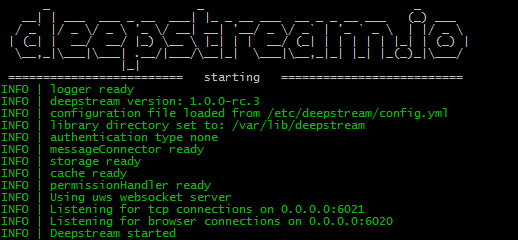

Deepstream is available via the apt package manager, and is currently within the following distributions:

- jessie

```bash
source /etc/lsb-release && echo "deb http://dl.bintray.com/deepstreamio/deb jessie main" | sudo tee -a /etc/apt/sources.list
sudo apt-key adv --keyserver hkp://keyserver.ubuntu.com:80 --recv-keys 379CE192D401AB61
sudo apt-get update
sudo apt-get install -y deepstream.io
```

## Starting deepstream
```bash
deepstream start
```



Learn more about the [command line interface](/docs/server/command-line-interface/).

### Configuring deepstream
You can either change deepstream's [configuration file](../../docs/server/configuration) directly in `/etc/deepstream` or create a copy and run deepstream with the `-c` flag. (Important, make sure to update all relative paths within the configuration after copying it).

```bash
$ cd ~
$ cp /etc/deepstream/* .
$ ls
config.yml  permissions.yml  users.yml
$ deepstream start -c config.yml
```
