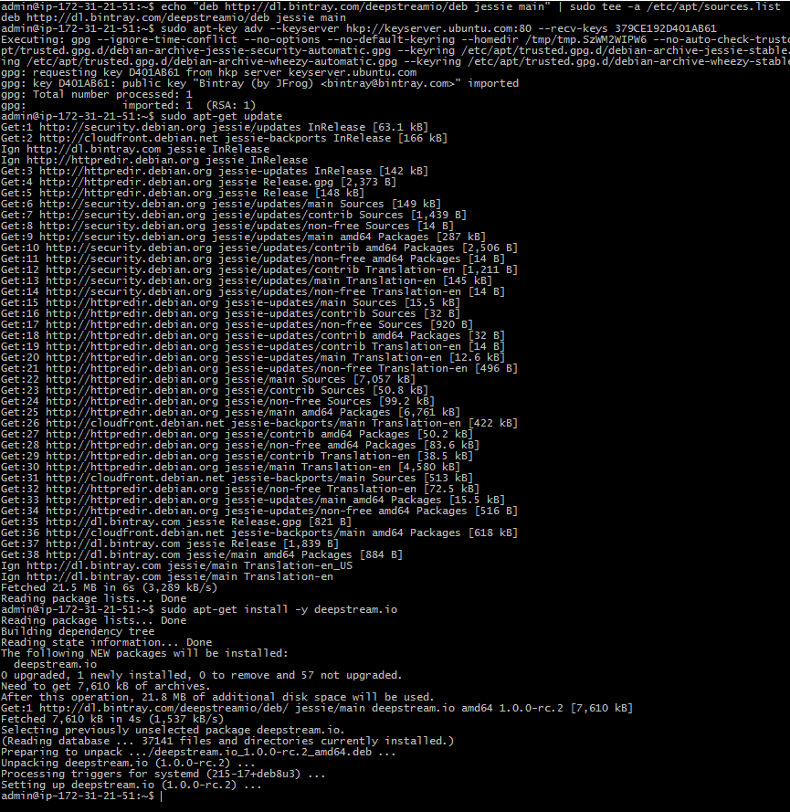

Deepstream is available via the APT package manager and currently supports Debian `jessie`.

To install, paste the following script into your terminal

```bash
# the source command makes the distro_name available as a variable
# the echo command creates a source list entry string for the deepstream repo
# the tee command appends it to APT's list of package sources
echo "deb http://dl.bintray.com/deepstreamio/deb jessie main" | sudo tee -a /etc/apt/sources.list

# downloads the key the distribution is signed with
sudo apt-key adv --keyserver hkp://keyserver.ubuntu.com:80 --recv-keys 379CE192D401AB61

# updates APT's registry with the newly available packages
sudo apt-get update

# installs deepstream. -y skips "are you sure?" question
sudo apt-get install -y deepstream.io
```

Resulting in



## Starting deepstream
deepstream can be started via its [command line interface](/docs/server/command-line-interface/).
```bash
deepstream start
```


### Configuring deepstream
You can either change deepstream's [configuration file](../../docs/server/configuration) directly in `/etc/deepstream` or create a copy and run deepstream with the `-c` flag. (Important, make sure to update all relative paths within the configuration after copying it).

```bash
$ cd ~
$ cp /etc/deepstream/* .
$ ls
config.yml  permissions.yml  users.yml
$ deepstream start -c config.yml
```

### Downloading deepstream's source code
You can also get the package and sources directly from [deepstream's release page](https://github.com/deepstreamIO/deepstream.io/releases)