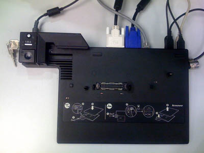
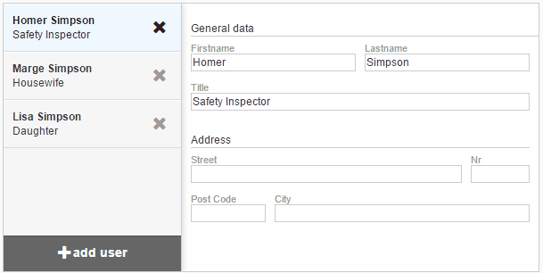
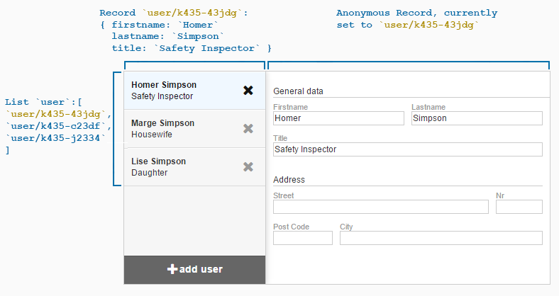

If you've read about [records](./datasync-records), you know that they are small data objects that can be observed and manipulated. A record lets you store values using `.set();`, retrieve them via `.get()` and listen for changes with `subscribe()`.

Anonymous records do exactly the same.

## What are anonymous records?
The only difference between a record and an anonymous record is that records have a unique name - but anonymous records don't. Instead, they have a `setName( name )` method that lets you change their name.

Conceptionally, an anonymous record is like a shell that wraps around other records. Listeners can be bound to that shell and stay intact while the underlying record changes.

If you ever had to work at a place that believes in hot-desking (I hope you haven't), you probably know these laptop docks:

They stay connected to the screen, keyboard and power plug etc., but let you switch the laptop that drives them. An anonymous record works pretty much the same way.

## What are anonymous records used for?
Anonymous records come in handy if a section of an interface can be used to manipulate different records of a similar type. Take this example app for instance:

Here, each of the Simpsons is a record. The names of all three are stored in a list. The section with the input-fields on the right is powered by a single anonymous record. All input-fields are two-way bound to paths within it.

Now, whenever the user selects one of the Simpsons, the anonymous record's `setName( id )` method is called with the `recordId` of that Simpson. It internally removes all subscriptions to the old record, switches to the new one, re-subscribes, all change-listener fire and the UI is up to date.

## How do I create an anonymous record?
By calling `client.record.getAnonymousRecord()`. The method doesn't take any arguments.

A few more things worth mentioning:

- All method calls to the anonymous-record, e.g. `delete()`, `discard()`, `get()` or `set()` are proxied to the currently underlying record.

- The anonymous record emits a `ready` event whenever `setName()` is called and the new record is ready

- The anonymous record also emits a `nameChanged` event immediately after every call to `setName()`
