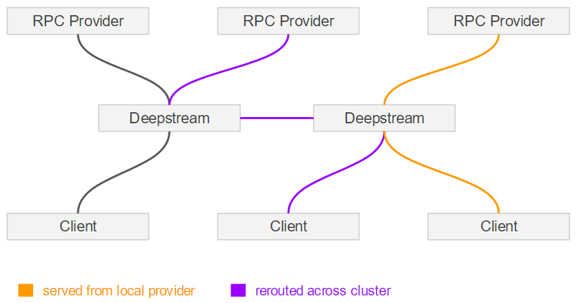

Remote Procedure Calls (RPC) are deepstream's mechanism for request/response communication (think Ajax Request, but with added load balancing and rerouting etc).

RPCs are helpful on their own as a substitute for classic HTTP workflows, but are particularly useful when combined with other deepstream concepts like pub/sub or data-sync.

## some great uses for RPC

* **Querying your database** If you’re using a database or search engine like [ElasticSearch](/tutorials/integrations/db-elasticsearch/) with deepstream, RPCs can be used to query data from it.
* **Interfacing with REST APIs** Need to retrieve a forecast from OpenWeatherMap, get a Github Repo’s commit history or query data from YQL? Create a process that forwards incoming RPCs as HTTP requests and returns the result.
* **Securely combining multi step record transactions** If you're building a realtime voting system, you might want to increase the vote count AND flag the user as having voted at the same time. Use an RPC for that.
* **Distributing computational load** Running expensive image processing tasks? Break your image into parts and let deepstream distribute them between RPC providers.
* **Asking users for input** Need to ask one of your users for input? RPCs can be used for question-answer workflows on the client as well.

## Using RPCs
Let's look at an example: adding two numbers (granted, not something you would strictly need to do on the backend, but lets keep things simple).

Every RPC is identified by a unique name. For our example, we'll choose `'add-two-numbers'`. First, a process needs to register as a "provider" - something that's capable of fulfilling a request. This is done using `client.rpc.provide()`

```javascript
client.rpc.provide( 'add-two-numbers', ( data, response ) => {
    response.send( data.numA + data.numB );
});
```

Now any client can invoke the remote method. This is done using `client.rpc.make()`.

```javascript
client.rpc.make( 'add-two-numbers', { numA: 7, numB: 13 }, ( err, result ) => {
    // result == 20;
});
```

## RPC routing
Processes can register as providers for multiple RPCs and many processes can provide the same RPC. Deepstream will try to route a client's request as efficiently as possible as well as load-balance incoming requests between the available providers.



Providers themselves are also able to reject requests (e.g. because they're under heavy load) using `response.reject()` which will prompt deepstream to re-route the request to another available provider.

```javascript
//Limiting to 50 simultanious image resize tasks at a time
var inProgress = 0;
client.rpc.provide( 'resize-image', ( url, response ) => {
    inProgress++;

    if( inProgress > 50 ) {
        response.reject();
    } else {
        resizeImage( url ).then(() => {
            inProgress--;
            response.send( 'done' );
        });
    }
});
```
