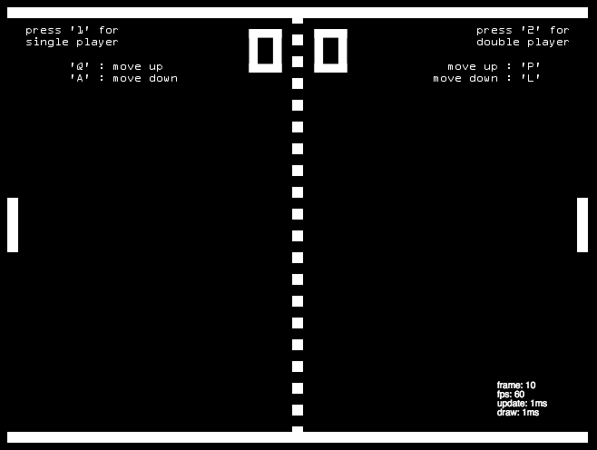
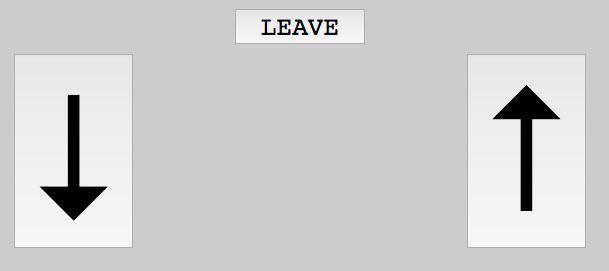

This tutorial will explain how to turn an existing client browser game into a
realtime multiplayer game using deepstream.io.

## Choosing a game

There is a nice pong implementation for the browser on [https://github.com/jakesgordon/javascript-pong](https://github.com/jakesgordon/javascript-pong).
It's implemented as a tutorial with 5 parts.
The multiplayer mode is limited to the a shared keyboard.



Let's improve the game with these features:

1. allow peple to join the game with their own device
2. allow to control (start and stop) the game from the device
3. allow to play on touch devices

There exists a fork of this game which contains a refactoring with a more npm styled
code base. The directory structure was changed as well, the tutorial _parts_ were removed towards a common project setup.

This tutorial is based on that fork: [gburnett/javascript-pong](https://github.com/gburnett/javascript-pong)

## Game architecture

To keep it simple we will keep all game logic in the main page (_index.html_).
This means that this page needs to be opened in a browser and only once! It acts as a monitor and a game server but as a client for data syncing to the deepstream server.

A player needs to open another page which contains only some controller for its pong paddle. This page acts
like a gamepad.

The players data (control input and status) is synced in realtime between the pages via deepstream.

## Main page

To allow the players to join the game with their own device it's a common practise to let them join via a QR code. The QR code will contain an URL to a special page which contains just the controls for the game. Let's also add an indicator if the player is online to start the game below the QR code. This way you can get rid of the controls description on canvas.

So let's adapt the sidebar and duplicate it for both players:

__index.html__

```html
<div class="sidebar sidebar-right">
  <h2>Player 2</h2>
  <a target="_blanK" href="/controls#2">
    <div class="qrcode" id="qrcode2"></div>
  </a>
  <div class="online online-2">online</div>
</div>
<div class="sidebar">
  <h2>Player 1</h2>
  <a target="_blanK" href="/controls#1">
    <div class="qrcode" id="qrcode1"></div>
  </a>
  <div class="online online-1">online</div>
</div>
```

To create the QR code we use the npm module `qrcodejs2` which can generate the code
in the browser.

__src/bootstrap.js__

```javascript
const options = {
  width: 128,
  height: 128,
  colorDark : "#000000",
  colorLight : "#ffffff",
  correctLevel : QRCode.CorrectLevel.H
}
new QRCode(document.getElementById("qrcode1"), Object.assign({
  text: window.location.origin + '/controls#1'
}, options))
new QRCode(document.getElementById("qrcode2"), Object.assign({
  text: window.location.origin + '/controls#2'
}, options))
```


## Browser bundling

The main page and controller page needs different JavaScript code. To avoid setting up another bundle file, which isn't so easy in combination with _budo_, we'll use just one bundle file.

To map the JavaScript code to each page at runtime we can change the entrypoint from _bootstrap.js_ to _index.js_ and add this check:

__src/index.js__

```javascript
if (window.location.pathname.indexOf('controls') !== -1) {
  require('./controls')
} else {
  require('./bootstrap')
}
```

## npm start script

A short explanation what the existing _npm start_ script is doing:

```
budo src/index.js --live --serve dist/bundle.js -- -t babelify | opnr | garnish
```

_budo_ is a combination of browserify and a HTTP server which provides incremental reloading with
LiveReload. You can still pass browserify arguments like _babelify_ for transpiling ES6 code.
_opnr_ opens the served content of budo in your default browser and _garnish_ is kind of a beautifier
for the console messages.

## Controller page


__controls.html__

```html
<!DOCTYPE html>
<html>
  <head>
    <title>pong controller</title>
    <meta http-equiv="Content-Type" content="text/html; charset=utf-8"/>
    <meta name="viewport" content="width=device-width, user-scalable=no">
    <link href="style/controls.css" media="screen, print" rel="stylesheet" type="text/css" />
  </head>
  <body>
    <div class="gamepad-container">
      <button class="gamepad gamepad-down">↓</button>
      <button class="gamepad gamepad-up">↑</button>
    </div>
    <script src="dist/bundle.js" type="text/javascript"></script>
  </body>
</html>
```

If the controller page is loaded the browser connects to the deepstream server and initialize
a player (record)[https://deepstream.io/docs/client-js/datasync-record/]. The record contains the player name (either 1 or 2 in our case) and a property
which indicates if the player is pressing a button (`'up'` or `'down'`) or if the button is not pressed (`null`).

__src/controller/index.js__

```javascript
const deepstream = require('deepstream.io-client-js')
const player = window.location.hash.substr(1) || 1

// ignore authentication in this tutorial
const ds = deepstream('localhost:6020').login({}, function() {
  if (success) {
    return new Gamepad()
  }
})
```

The _Gamepad_ class register event listener for both touch devices and mouse devices.

__src/controller/index.js__

```javascript
class Gamepad {
  constructor() {
    const buttons = document.querySelectorAll('.gamepad')
    this.initializeRecords('player/' + player)
    // up
    this.addEventListener(buttons[0], ['touchstart', 'mousedown'], this.onButtonPress)
    this.addEventListener(buttons[0], ['mouseup', 'touchend'], this.onButtonRelease)
    // down
    this.addEventListener(buttons[1], ['touchstart', 'mousedown'], this.onButtonPress)
    this.addEventListener(buttons[1], ['mouseup', 'touchend'], this.onButtonRelease)
  }

  addEventListener(element, types, handler) {
    for (let i=0; i<types.length; i++) {
      const type = types[i]
      element.addEventListener(type, handler.bind(this))
    }
  }

  initializeRecords(playerRecordName) {
    this.record = ds.record.getRecord(playerRecordName)
    this.record.set({
      name: player,
      direction: null
    })
  }

  onButtonPress(event) {
    event.preventDefault()
    const target = event.target
    const up = target.classList.contains('gamepad-up')
    const down = target.classList.contains('gamepad-down')
    let direction
    if (up) {
      direction = 'up'
    } else if (down) {
      direction = 'down'
    } else {
      direction = null
    }
    this.updateDirection(direction)
  }

  updateDirection(direction) {
    this.record.set('direction', direction)
  }

  onButtonRelease() {
    this.record.set('direction', null)
  }
}
```

## Subscribe to record changes

Let's add some code to subscribe to the records changes on the main
page in order to update the paddle.

First we need to connect to the deepstream server like we did in on
the controller page:

__src/game.js__

```javascript
const deepstream = require('deepstream.io-client-js')
const dsClient = deepstream('localhost:6020').login({})
```

Add the record subscriptions to the `Runner.addEvents` function

__src/game.js__

```javascript
addEvents: function() {
  Game.addEvent(document, 'keydown', this.onkeydown.bind(this))
  Game.addEvent(document, 'keyup',   this.onkeyup.bind(this))

  const player1 = dsClient.record.getRecord('player/1')
  const player2 = dsClient.record.getRecord('player/2')
  player1.subscribe(data => {
    this.game.updatePlayer(1, data.direction)
  })
  player2.subscribe(data => {
    this.game.updatePlayer(2, data.direction)
  })
},
```

Then add these two functions to the `Pong` object:

__src/pong.js__

```javascript
  updatePlayer: function(player, direction) {
    if (player == 1) {
      this.updatePaddle(this.leftPaddle, direction)
    } else if (player == 2) {
      this.updatePaddle(this.rightPaddle, direction)
    }
  },

  updatePaddle: function(paddle, direction) {
    if (!paddle.auto) {
      if (direction === 'up') {
        paddle.moveUp();
      } else if (direction === 'down') {
        paddle.moveDown();
      } else if (direction === null) {
        paddle.stopMovingUp()
        paddle.stopMovingDown()
      }
    }
  },
```

That's it! Now we converted the game into a realtime multiplayer game.

## Wait, how can I play it?

[](https://asciinema.org/a/chefx8d9q1ncqy931uzt0q9dv)

In order to play it now we just need a deepstream server which we can
install by `npm i deepstream.io --save`.

To run the server we can add a npm script which uses the default config file:

__package.json__

```javascript
//...
"scripts": {
  "deepstream": "deepstream start -c node_modules/deepstream.io/conf/config.yml",
  //...
},
//...
```

Now we can start deepstream.io via `npm run deepstream`. Just note that you need
another terminal for `npm start` because both processes are keep running until you termine them via `CTRL + C`.

## How can I join the game from another device?

Since we used `localhost` to connect to the deepstream server the game would
only work on the same machine, in other words: We can open the controls page in
another browser but not on the smartphone or another computer.

Let's provide an environment variable to allow to set the IP.

We need to change the deepstream host in _src/controls/index.js_ and _src/game.js_.
to this:

```javascript
const DEEPSTREAM_HOST = process.env.DEEPSTREAM_HOST || 'localhost:6020'
const dsClient = deepstream(DEEPSTREAM_HOST).login({});
```

To set the environment values during browserify bundling step we need to add a
browserify transformer: `envify` and just append a `-t envify` to both npm scripts.

To let the browser open the main page with the proper IP (in order to generate the correct QR codes) we can add anoter environment variable with a default value. We need to pass it as an argument to budo: `--host ${SERVER_IP:-0.0.0.0}`

At the end the scripts should look like this:

```javascript
//..
"scripts": {
  "deepstream": "deepstream start -c node_modules/deepstream.io/conf/config.yml",
  "start": "budo src/index.js --live --host ${SERVER_IP:-0.0.0.0} --serve dist/bundle.js -- -t babelify -t envify | opnr | garnish",
  "build": "browserify src/bootstrap.js -t babelify -t envify | uglifyjs > dist/bundle.js"
},
//..
```

If you want to play in your WiFi network you need to find out your WiFi IP address and run this command:

```shell
SERVER_IP=192.168.1.10 DEEPSTREAM_HOST=192.168.1.10:6020 npm start
```

## Starting and stopping the game



To improve the UX we add another record which contains the current status
of the game, like if there is a winner and which players currently online.

With that information the players can start and stop the game.

Let's add a join/leave button to the controler page:

__controls.html__

```html
<button class="join-leave">join</button>
```

And add handlers to the _Gamepad_ class to toggle the state between online and offline.
We use another record (status) with a property for each player: `player1-online` and `player2-online`.

__src/controls/index.js__

```javascript
class Gamepad {
  constructor() {
  	//...
    this.joinButton = document.querySelector('.join-leave')
    this.addEventListener(this.joinButton, ['click'], this.startStopGameHandler)
  }

  initializeRecords(playerRecordName) {
    //...
    const statusRecord = ds.record.getRecord('status')
    statusRecord.subscribe(`player${player}-online`, online => {
      if (online === true) {
        document.body.style.background ='#ccc'
        this.joinButton.textContent = 'leave'
      } else {
        document.body.style.background ='white'
        this.joinButton.textContent = 'join'
      }
    }, true)
  }

  startStopGameHandler(e) {
    ds.record.getRecord('status').whenReady(statusRecord => {
      const oldValue = statusRecord.get(`player${player}-online`)
      statusRecord.set(`player${player}-online`, !oldValue)
    })
  }
}
```

In the `Runner.addEvents` function we can now listen to the status record and toggle the
online indicator. To start the game both players need to join the game.

__src/game.js__

```javascript
const status = dsClient.record.getRecord('status')
status.subscribe('player1-online', online => {
  this.toggleChecked('.online-1', online)
  this.updateGameStatus(online, status.get('player2-online'))
})
status.subscribe('player2-online', online => {
  this.toggleChecked('.online-2', online)
  this.updateGameStatus(status.get('player1-online'), online)
})
```

and add a new function to the `Runner` object:

__src/game.js__

```javascript
updateGameStatus: function(player1, player2) {
  if (player1 && player2) {
    this.game.stop()
    this.game.startDoublePlayer()
  } else {
    this.game.stop()
  }
}
```

## Send feedback to the player

Let's give the user some feedback if you did a goal and if he win a match.
The status record can be reused with another property: `player1-goals` and `player2-goals`.
We can trigger a function from the `Pong.goal` function:

__src/pong.js__

```javascript
//...
this.runner.notifyGoal(playerNo, this.scores[playerNo], lastGoal);
//...
```

and add the new function to the `Runner` object. We can also reset the
online status for the players if the game is over:

__src/game.js__

```javascript
notifyGoal: function(playerNo, goals, lastGoal) {
  const statusRecord = dsClient.record.getRecord('status')
  if (lastGoal) {
    statusRecord.set('player1-online', false)
    statusRecord.set('player2-online', false)
  }
  statusRecord.set(`player${playerNo+1}-goals`, {amount: goals, lastGoal: lastGoal})
},
```

Now we need to listen to the goals property in the _Gamepad_ class within the `initializeRecords` function:

__src/controls/index.js__

```javascript
//...
statusRecord.subscribe(`player${player}-goals`, data => {
  if ('vibrate' in navigator) {
    if (data.lastGoal) {
      navigator.vibrate([100, 300, 100, 300, 100])
    } else {
      navigator.vibrate(100)
    }
  }
})
```

## Use accelerometer to control the paddle
WIP (last step of the tutorial)

