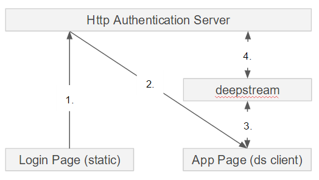
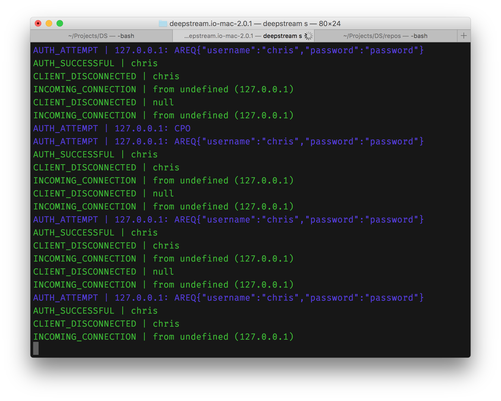

Authentication is vital to most apps and the way it is achieved has evolved substantially in recent years. One of the most popular of today's concepts is a standard called [JSON Web Token](https://jwt.io/) or JWT for short that lets you store encrypted information in verifiable tokens.

deepstream can use a number of strategies to authenticate incoming connections. For JWT we'll use the [HTTP-Webhook](/tutorials/core/auth-http-webhook/) - a configurable URL that deepstream will send both login and connection data to for verification.

## Should you use JWT with deepstream?
Maybe. Traditional tokens serve as primary keys to session data, meaning they help the backend retrieve data relative to a user's session from a database or cache. A JWT, on the other hand, IS the actual session data - the cookie itself contains a payload and releases the backend from having to constantly look session data up.

This is great for HTTP workflows where clients make many individual requests that are all associated with the same user. deepstream, however, uses a persistent connection that is only established once when the client connects (okay, and maybe occasionally again if the connection drops). All session data stays associated with that connection, rather than with the requests and subscriptions made through it. As a result, deepstream messages are significantly smaller and faster than their HTTP equivalents.

This, however, does mean that deepstream itself doesn't benefit much from using JWT. It doesn't hurt much either though and can still be helpful when deepstream is used in conjunction with traditional HTTP endpoints.

## deepstream's Auth Webhook
Before you begin performing authentication with JWT, it's worth noting that deepstream allows you to register an HTTP endpoint URL to which connection data is forwarded as POST request whenever a client or backend process attempts to log in.


The [HTTP Authentication](/tutorials/core/auth-http-webhook/) guide covers how to setup this workflow in your project.

## deepstream HTTP Auth with JWT
[JWT](https://jwt.io) allows us to transport claims securely from the server to client and vice versa using an encoded JSON string. This token is persisted on the client and used to make authorized requests as long as the token is valid (not tampered with and not expired).

Looking back at the flow described above, JWT needs to be put somewhere in the picture. For that, there are two choices:

## The simple, but less secure one


In this scenario, the deepstream client sends the user's credential to deepstream which forwards it to a configured HTTP endpoint.

The endpoint creates the JWT and passes it back through deepstream to the client which stores it in localStorage

For subsequent requests, the token is already in localStorage and will be sent by the client instead of asking the user for credentials.

### Why is this less secure?
Storing the token in localStorage or in a cookie using javascript makes it readable by all scripts on the page. This leaves it open for cross-site scripting attacks (XSS) that can hijack the session.

Likewise, this approach requires the web application itself and all its assets to be publicly readable. Using the following approach, however, would allow you to redirect all unauthenticated requests to the web app to a login page.

## The complicated, secure one
The recommended workflow looks as follows:



The steps shown here are

1. The user provides credentials in a static login page which are sent via HTTP POST request to the auth server.
2. If the provided credentials are valid, the server generates a JWT and responds with a 301 redirect to the web-app page that stores the token as a cookie
3. The deepstream client establishes a connection to the deepstream server and authenticates itself by calling `ds.login(null, callback)`. This sends the stored cookie containing the JWT to the deepstream server.
4. deepstream forwards the cookie to the authentication server and awaits its reply. The auth server also has the option to parse the cookie and provide the data it contains back to deepstream to use within [Valve Permissions](/tutorials/core/permission-conf-simple/). If the authentication server returns a positive response (e.g. HTTP code 200) the connection is authenticated.

So much for the theory - here's how this works in practise:

## Let's start with the login page
/login


From the recommended flow diagram, we need to attempt a login using a form and if that is successful, we generate a token and persist the token to cookie:

```html
<form action="/handleLogin" method="POST">
    <div class="form-group">
        <label for="username">Username</label>
        <input type="text" id="username" name="username" class="form-control">
    </div>
    <div class="form-group">
        <label for="password">Password</label>
        <input type="password" id="password" name="password" class="form-control">
    </div>
    <div class="form-group">
        <button class="btn btn-primary" type="submit" id="login-button">Login</button>
    </div>
</form>
```

Just two controls -- a username and a password. The form is submission is to be handled by a `/handleLogin` route, let's see what that looks like.

Using [Node](https://nodejs.org) with [Express](http://expressjs.com/) the route can be handled using the following approach:

```js
// . . .
var jwt = require('jsonwebtoken');

/* GET home page. */
app.post('/', function(req, res, next) {
  
   var users = {
    wolfram: {
      username: 'wolfram',
      password: 'password'
    },
    chris: {
      username: 'chris',
      password: 'password'
    }
    // . . .
  }

  var user = users[req.body.username];

  if (!user) {
      res.status(403).send('Invalid User')
    } else {
      // check if password and username matches
      if (user.username != req.body.username || user.password != req.body.password) {
        res.status(403).send('Invalid Password')
      } else {

        
        // if user is found and password is right
        // create a token
        var token = jwt.sign(user, 'abrakadabra');

        
        // return the information including token as JSON
        // set token to cookie using the httpOnly flag
        res.cookie('access_token', token, {httpOnly: true}).status(301).redirect('/');
      }   
    }
});

module.exports = router;
```

The `jsonwebtoken` module is used to generate and sign a token using the auth payload which of course is verified first. The token is then stored in the cookie as `access_token` while the `httpOnly` flag is set to `true` so as disable `script` access from the client. Finally, the user is redirected to the home page if everything works out fine.


## Enabling HTTP Auth
By default, HTTP Authentication is disabled. It needs to be enabled via the [configuration file](/docs/server/configuration/) while setting up some configuration as well:

```yaml
type: http
options:
  endpointUrl: https://someurl.com/auth-user
  permittedStatusCodes: [ 200 ]
  requestTimeout: 2000
```

Remember, the ds client makes a request to ds server through your browser so there should be a way to forward this request to our own server. This is achieved using the `endpointUrl`. `permittedStatusCodes` allows you to specify a list of acceptable HTTP status codes while the `requestTimeout` option specifies how long the request should wait for a response before hanging up.

## deepstream Login
From what you know already, deepstream's `login` method is always called immediately after initialization:

```js
var client = deepstream('localhost:6020')
          // Login method
          .login( null, ( success, clientData ) => {

      })
        .on( 'error', ( error ) => {
            console.error(error);
         });
```

The deepstream client only becomes functional once `login` is called. Please
The method takes no credentials and can be known as anonymous authentication. There is more to the `login` method. An authentication object containing the `username` and `password` could be passed in:

```js
var usernameText = document.getElementById('username').value,
    passwordText = document.getElementById('password').value;
    
var client 
    = deepstream('0.0.0.0:6020')
          .login({
          // Credentials from text input
            username: usernameText,
            password: passwordText
            })
          .on( 'error', ( error ) => {
            console.error(error);
          });
```

Your next login attempt will produce the following log:



We are making use of JWT for authentication, therefore, the credentials are not necessary so we stick to anonymous.


## Auth Webhook
Back to the homepage or app page, deepstream login is attempted with `null` credentials. This is because the payload is no longer necessary as they can be retrieved from the token when it is decoded.

When the login method executes successfully, it is expected to call the `endpointUrl` specified in the `conf.yml` file. The call is as a result of deepstream server forwarding request to the HTTP server. This `endpointUrl` handler should be prepared to receive payload in the following manner:

```json
{
  "connectionData": {...},
  "authData": {
      username: 'chris',
      password: 'password'
  }
}
```

The `endpointUrl` is expected to tell deepstream that Auth was successful by returning `200` which is the only status code we want to allow as seen in `conf.yml`:

```js
//. . .
var jwt = require('jsonwebtoken');

app.post('/', function(req, res) {
  var token = getCookie(req.body.connectionData.headers.cookie, 'access_token');
  jwt.verify(token, 'abrakadabra', function(err, decoded) {      
      if (err) {
        return res.status(403).send('Failed to authenticate token.' );    
      } else {
        // if everything is good, save to request for use in other routes
        res.status(200).json({
          username: decoded.username, 
          clientData: { username: decoded.username }
        });
      }
    });
});

function getCookie(src, cname) {
    // utility method to retrieve a cookie from cookie string
}

module.exports = router;
```
We still use the `jsonwebtoken` module to verify the token and decode the string into JSON. The decoded value contains the auth payload (username and password) which is sent to the deepstream client.

The client expects a result after the login and this result can be captured using the `client.login` second argument which is a callback:

```js
client.login(null, function(success, data) {
    if(!success) {
      console.log('Error occured');
      return
    }
    // Data is the payload sent back from 
    // the  `/validateLogin` route which includes a token
    console.log(data); // {username: chris}
  })
```

## Protecting Routes

At the moment we have completed the authentication process following the recommended flow diagram. What we have not done which is the point after all is to protect resources and routes from being accessed by an unapproved user.

Express makes this quite easy so all you need to do is create what is called a middleware which checks if the token is present and whether it is valid. If that is the case, the user is allowed access else, the user is thrown out:

```js
var jwt = require('jsonwebtoken');
module.exports = function(req, res, next) {

  console.log(req);
  // check header for cookies
  var token = req.cookies.access_token;
  
  // decode token
  if (token) {
    // verifies secret and checks exp
    jwt.verify(token, 'abrakadabra', function(err, decoded) {      
      if (err) {
        return res.json({ success: false, message: 'Failed to authenticate token.' });    
      } else {
        // if everything is good, save to request for use in other routes
        req.decoded = decoded;    
        next();
      }
    });

  } else {

    // if there is no token
    // return an error
    return res.status(403).redirect('/');
    
  }
};
```

Middlewares are much like routes but rather than returning a valid route when all goes well, it calls the `next` method which tells Express to continue down the routes pipeline. If `next` is not called and an error is thrown, the routes down the pipeline are never executed.

To protect a route with the middleware, you can do something like the following:

```js
app.get('/users', authMiddleware, users);
```

Where `authMiddleware` is the middleware function and `users` is the route handler.
