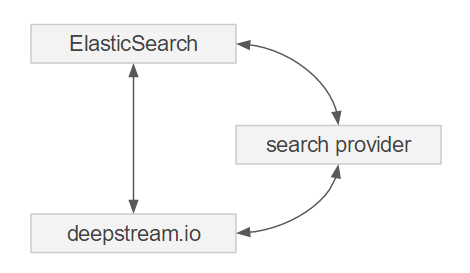

#### What is ElasticSearch
[ElasticSearch](https://www.elastic.co/products/elasticsearch) is a standalone search engine that let's you add powerful full-text search capabilities to your application. You might be thinking right now: __what's wrong with a bit of MySQL and `WHERE content like %word%`?__...well, ElasticSearch is an entirely different league. It offers word stemming (search "fisher" also searches fish, fishing etc.), synonyms and related words ( "UK" also searches for United Kingdom, Great Britain etc.) and a number of other crucial concepts for proper search capabilities.
You can run ElasticSearch yourself as a single server or a cluster or use it as a service, e.g. via [AWS ElasticSearch](https://aws.amazon.com/elasticsearch-service/).

#### Using ElasticSearch with deepstream.io
ElasticSearch's powerful search capabilities can be a great addition for many deepstream apps, but there are some things to be aware of:

**Use it with a persisting cache** ElasticSearch can be used just as a normal data-base to store deepstream records, but it is first and foremost a search engine. When used with deepstream.io, we'd recommend also using a cache that saves data to disk, e.g. [Redis](../cache-redis) as a faster way of storing and accessing data.

**ElasticSearch's 'realtime search' means something different** [There's a lot of discussion about what __realtime__ exactly means](https://deepstream.io/blog/what-is-realtime/). For deepstream and many others, it means that data is sent to you as it becomes available.
'Realtime search' in this context means that new results are streamed out as soon as they match an existing query. This interpretation us shared by others, e.g. [RethinkDB](../db-rethinkdb/) as well.
ElasticSearch also mentions its "realtime search capabilities". Here it means though that results can be searched for immediately after a write to the database (as opposed to e.g. a Hadoop cluster where data only becomes available after a significant delay). To search for the newly added data however, you still have to execute a new query.

#### Storing deepstream's data in ElasticSearch
Storing data in ElasticSearch is easy. Just use deepstream's storage connector for ElasticSearch.


#### Querying ElasticSearch from deepstream
You have two choices: ElasticSearch offers a well structured REST API that can be accessed directly via HTTP (e.g. via an Ajax call from the Browser). This can be a simple and very solid choice, especially when used with a managed ElasticSearch deployment as a service.

ElasticSearch can also be accessed from within deepstream through a remote procedure call (RPC). For this, you'll need to create a backend process that sits in between deepstream and the search engine.



Say we create a (admittably nonsensical) set of records like
```javascript
ds.record.getRecord( 'cars/ferrari' ).set({
    brand: 'Ferrari',
    color: 'Red'
});
```

and our greatest desire in life would be to execute a RPC that searches for a brand and returns its signature color

```javascript
ds.rpc.make( 'search-color-for-brand', 'Ferrari', ( err, color ) => {
    //color === red
});
```

our search provider would look as follows:

```javascript
var elasticsearch = require('elasticsearch');
var deepstream = require( './ds-client' );

// Create ElasticSearch Client
var es = new elasticsearch.Client({
  host: 'elasticsearch-host',
  log: 'trace'
});

// Create Deepstream Client
var ds = deepstream( 'deepstream-host' ).login();

// Register as provider for search-color-for-brand
ds.rpc.provide( 'search-color-for-brand', ( brand, response ) => {

    // Query ElasticSearch
    es.search({
        index: 'deepstream',
        q: 'brand=' + brand
    }).then((body) => {
        // Return result
        response.send( body.hits.hits.color );
    }, (error) => {
        //Return Error
        response.error( error.toString() );
    });
});
```