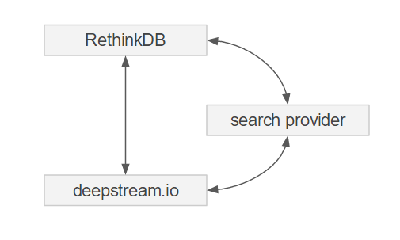

#### What is RethinkDB?
RethinkDB is a distributed, document-oriented database. It implements a proprietary, function based query language, called ReQL to interact with its schemaless JSON data collections.

What makes RethinkDB stand out is its ability to perform “realtime queries”. Rather than just retrieving query results as snapshots of the current state, RethinkDB allows to keep search result cursors open and stream continuous updates as new documents match or unmatch the query.

#### Why use RethinkDB with deepstream?

RethinkDB’s realtime search makes it a great fit as a datastore within a deepstream architecture. Combining its search capabilities with deepstream’s data-sync, pub/sub and rpc can be a very powerful combination.

#### Any downsides?
Not really. We’ve used RethinkDB extensively within internal architectures and can very much recommend it. As database lifecycles go, it’s still very young and unestablished, but seeing increasing adoption. At the moment, the realtime querying capabilities aren’t compatible with all query types (e.g. aggregate queries like averages etc. aren’t supported), sharding is limited to 64 nodes and load balancing / shard accessing can require connection redirects.

#### What about Horizon.io?
RethinkDB offers a NodeJS module called [horizon](https://horizon.io/). If you’re looking to access RethinkDB’s querying capabilities via ReQL directly from the browser, this will be a better choice.
Deepstream in comparison is a full, data-base agnostic realtime server. It provides higher level structures like data-sync, pub/sub and request/response, making it more flexible. Deepstream is horizontally scalable via clustering and is highly tuned for performance and speed, using an intermediate caching layer for faster data-access.

#### How to use RethinkDB with deepstream.io
Deepstream offers a database connector plugin for RethinkDB and optionally also a search provider that creates realtime queries based on dynamic list names. RethinkDB and the search provider are also part of the [extended Docker-image](TODO).

**Installing the RethinkDB storage connector**

You can install the rethinkdb connector via deepstream's commandline interface, using:

```bash
deepstream install storage rethinkdb
```

or in windows
```bash
deepstream.exe install storage rethinkdb
```

resulting in


If you're using deepstream's NodeJS interface, you can also install it as an [NPM module](https://www.npmjs.com/package/deepstream.io-storage-rethinkdb)

**Configuring the RethinkDB storage connector**
You can configure the storage connector plugin in deepstream with the following options:

```yaml
storage:
  path: rethinkdb
  options:

    # address rethinkdb is bound to
    host: localhost

    # port rethinkdb is bound to
    port: 28015

    # optional authentication key for rethinkdb
    authKey: someString

    # optional database name, defaults to `deepstream`
    database: someDb

    # optional table name for records without a splitChar
    # defaults to deepstream_records
    defaultTable: someTable

    # optional character that's used as part of the
    # record names to split it into a tabel and an id part, e.g.
    #
    #books/dream-of-the-red-chamber
    #
    # would create a table called 'books' and store the record under the name
    # 'dream-of-the-red-chamber'. Defaults to '/'
    splitChar: /
```

## search provider
<a class="npm-download big" href="https://www.npmjs.com/package/deepstream.io-provider-search-rethinkdb">download search provider</a>

The RethinkDB search provider is an independent process that sits between deepstream and RethinkDB. It let's you create lists with dynamic names such as `search?{"table":"book","query":[["title","match","^Harry Potter.*"],["price","lt",15.3]]}` on the client that automatically map to realtime searches on the backend



Here's an example: Say you're storing a number of books as records.

```javascript
ds.record.getRecord( 'book/i95ny80q-2bph9txxqxg' ).set({
    'title': 'Harry Potter and the goblet of fire',
    'price': 9.99
});
```

and use deepstream.io's RethinkDB storage connector with

```javascript
{ splitChar: '/' }
```

you can now search for Harry Potter books that cost less than 15.30 like this

```javascript
var queryString = JSON.stringify({
    table: 'book',
    query: [
        [ 'title', 'match', '^Harry Potter.*' ],
        [ 'price', 'lt', 15.30 ]
    ]
});
ds.record.getList( 'search?' + queryString );
```

and the best thing is: it's in realtime. Whenever a record that matches the search criteria is added or removed, the list will be updated accordingly.