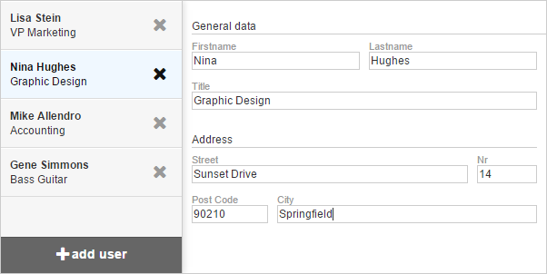

## What's KnockoutJs?
You've probably heard of Angular, React and EmberJS, maybe even Vue or Polymer. But [KnockoutJS](http://knockoutjs.com/)? No? That's a shame...
Knockout is a clever library with only one concept: An "observable" - something with a value that tells you when that value changes.

Granted, Knockout comes with all sorts of other concepts that let you work with observables as well: templating to render the observable's value to the view, observable arrays to maintain collections of observables or "bindings", similar to Angular directives, that let you link observables with form elements.

## Is KnockoutJS a good fit for deepstream?
Larger realtime applications can easily get complex. Changes occur at any time and updates need to be processed in all sorts of orders. Trying to orchestrate this yourself can be an enormous task.
To illustrate what I mean, here's what it takes to keep an input field in sync with a record's value using jQuery.

```javascript
ds.record.getRecord('book/moby-dick').whenReady(( record ) => {
    var input = $('#book-title');

    record.subscribe( 'title', ( title ) => {
        input.val( title );
    }, true );

    input.change(() => {
        record.set( 'title', input.val() );
    });
});
```

Now that's not exactly the end of the world, but with Knockout and deepstream's [KoTools](https://github.com/deepstreamIO/deepstream.io-tools-ko) this can be reduced to

```javascript
    this.title = koTools.getObservable( record, 'title' );
```

## Functional-Reactive Programming (hurray!)
Knockout makes it easy to implement a paradigm called [functional reactive programming](https://en.wikipedia.org/wiki/Functional_reactive_programming) that's perfectly suited for realtime apps.
In FRP, you model the data in your application as "pipelines", "asynchronous data-flows" or "event-streams". Logic lives within these streams as junctions, valves or task pipelines and is applied in response to incoming data. This keeps complexity low and releases you from having to orchestrate interrelated states.

## Ko-Tools
Knockout has observable properties and observable arrays. Deepstream has observable lists and records with path bindings. Our tool maps the two together. You can get if from NPM or Bower as `deepstream.io-tools-ko` or [browse the source on Github](https://github.com/deepstreamIO/deepstream.io-tools-ko).

```javascript
// Create a list that's two-way bound to a ko.observableArray
AppViewModel = function() {
    var userList = ds.record.getList( 'users' );
    this.users = koTools.getViewList(  UserViewModel, userList );
};

// Create a record and create two-way bound ko.observables
UserViewModel = function( userRecordName, viewList ) {
    this.record = ds.record.getRecord( userRecordName );
    this.viewList = viewList;
    this.firstname = koTools.getObservable( this.record, 'firstname' );
    this.lastname = koTools.getObservable( this.record, 'lastname' );
    this.isActive = ko.observable( false );
};
```

## Example App
You can find an example app using deepstream, KnockoutJS and the ko-tools on [Github](https://github.com/deepstreamIO/ds-demo-simple-app-ko).


