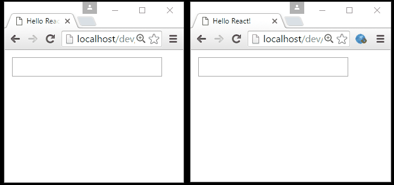
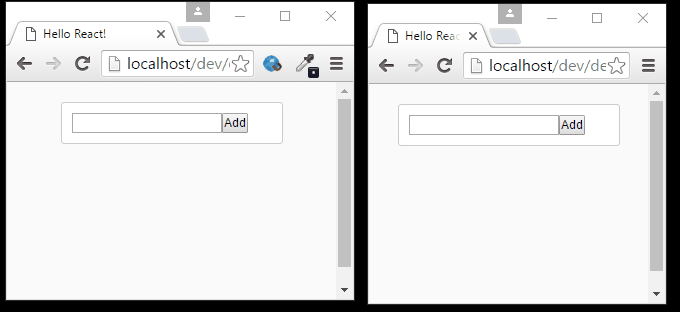

deepstream and react share the same belief: apps are best composed from reusable components, driven by state. What deepstream brings to react is the ability to store this state and sync it across connected clients.

To make this easier, we've developed **deepstream-react** - a mixin that let's you add realtime sync to any component with just a single line of code.

```javascript
mixins: [ DeepstreamReact ],
```

## How to use deepstream-react
You can get deepstream-react from NPM or bower as `deepstream.io-tools-react` or [browse the source on Github](https://github.com/deepstreamIO/deepstream.io-tools-react).

deepstream has a concept called "records". A record is a bit of JSON data that can be observed and manipulated by clients and that's stored and synced by the deepstream server.

deepstream-react binds a deepstream record to a react component's state. Here's what that looks like:



Let's replicate the example above. First, you need a deepstream server running on port 6020. If you haven't used deepstream yet, quickly head over to the [getting started tutorial](../../core/getting-started-quickstart/)...don't worry, I'll wait.

Once your server is running, it's time to create our react-app. Let's start by installing the deepstream javascript client and deepstream-react

```
npm install deepstream.io-client-js deepstream.io-tools-react --save
```

Next: connect to the server, log in and register the client instance with deepstream-react. Sounds tougher than it is:

```javascript
var deepstreamClient = require( 'deepstream.io-client-js' );
var DeepstreamMixin = require( 'deepstream.io-tools-react' );

ds = deepstreamClient( 'localhost:6020' ).login({}, function(){
    //ReactDOM.render call will go in here
});
DeepstreamMixin.setDeepstreamClient( ds );
```

Every deepstream record is identified by a unique name. To tell your component which record it should use, you need to specify a `dsRecord` property.

```javascript
ReactDOM.render(
    <SyncedInput dsRecord="some-input" />,
    document.getElementById( 'example' )
);
```

And that's it. Just write your react-components as usual, all changes will be persisted and synced via deepstream.

```jsx
var SyncedInput = React.createClass({
    mixins: [ DeepstreamMixin ],
    setValue: function( e ) {
        this.setState({ value: e.target.value });
    },
    render: function() {
        return (
            <input value={this.state.value} onChange={this.setValue} />
        )
    }
});
```

You can find also the code for this example on [Github](https://github.com/deepstreamIO/ds-tutorial-react/tree/master/synced-input)

### What about state that I don't want to be synced?
Quite often your component state contains data that you don't want to be stored or synced, e.g. temporary values from an input field that need to be validated first or composite values, e.g. `fullName` that are composed from a first and lastname entry.

For those values, deepstream-react supports a `local` namespace. Just store anything you want to be excluded under it.

```javascript
this.setState({
    importantData: 'this will be synced',
    local: {
        temporaryData: 'this will be excluded'
    }
});
```

### How about a more complex example?
Granted, a single input doesn't constitute an app - and it's often easier to see things being used in context. So [here's a take on react's classic todo-app](https://github.com/deepstreamIO/ds-tutorial-react/tree/master/todo-list), using *deepstream-react*.



### Prefer to use deepstream directly?
No problem, raw deepstream works just as well with react. You can find an [example app that demonstrates that here](https://github.com/deepstreamIO/ds-demo-simple-app-react):


